<div align="center">

# ⚡ **IgnisNode** ⚡

### _Signet Lightning Node — iOS_

[](https://swift.org/)
[](https://developer.apple.com/ios/)
[](https://developer.apple.com/xcode/)
[](https://github.com/lightningdevkit/ldk-node)
[](https://en.bitcoin.it/wiki/Signet)
[](LICENSE)

</div>

---

## 🎯 **What is IgnisNode?**

**IgnisNode** is an iOS app built with **SwiftUI** that runs a **[Bitcoin Signet](https://en.bitcoin.it/wiki/Signet)** [LDK Node](https://github.com/lightningdevkit/ldk-node) on-device: chain sync via **Esplora**, gossip via **RGS**, Lightning **peer connect** (manual entry, QR scan, invite QR), and a glass-themed home UI for **status**, **node id**, **receive address**, **live snapshot**, and **logs**.

**Figures** below use a consistent color code for quick scanning: **blue** — UI and app shell; **green** — LDK and node core; **purple** — network services; **pink** — UI automation; **amber** — decisions and build steps.

### 🌟 **Key Features**

- **Non-custodial Signet node** — LDK `Node` lifecycle owned by `NodeBootstrap` for the app process lifetime
- **Esplora + RGS** — Block sync and gossip snapshot from configurable HTTP endpoints
- **Peers** — Normalize addresses, parse invites, QR scan, LAN-oriented helpers
- **Glass UI (iOS 26)** — Built with **Liquid Glass** materials: `glassEffect`, `GlassEffectContainer`, and `.glass` controls; boot overlay (Lottie), snapshot panel, network footer chips (Signet · Esplora · RGS)
- **Observability** — Log console, filesystem logger, pull-to-refresh
- **Tests** — Unit (`NodeStorage`), integration (two-node loopback), UI tests (`ignis.*` accessibility IDs, `-ui-testing`)

> _Run Signet Lightning on your phone — learn, demo, and iterate locally._

---

## 📚 **Table of Contents**

1. [🎯 What is IgnisNode?](#what-is-ignisnode)
2. [✨ Features](#features)
3. [🦾 Tech Stack](#tech-stack)
4. [📂 Project Structure](#project-structure)
5. [📸 Screenshots](#screenshots)
6. [🚀 Quick Start](#quick-start)
7. [👨‍🔧 Detailed Setup (Xcode)](#detailed-setup-xcode)
8. [🧪 Testing](#testing)
9. [🏗️ Architecture & diagrams](#architecture--diagrams)
10. [📦 Dependencies](#dependencies)
11. [🔧 Build & test](#build--test)
12. [⚙️ Configuration defaults](#configuration-defaults)
13. [🤝 Contributing](#contributing)
14. [📜 License](#license)
15. [📬 Contact](#contact)

---

## ✨ **Features**

### 📱 **On-device node**

- **Single `NodeBootstrap`** — `@MainActor`, `@Observable`, owns Esplora/RGS configuration and LDK `Builder` → `start()` / `stop()`
- **Storage** — `Application Support/IgnisNode/signet/` via `NodeStorage`
- **P2P** — Default listen port **9735** (`NodeP2P`), aligned with invites and `listeningAddresses`

### 🎨 **User interface**

- **iOS 26 Liquid Glass** — Surfaces use SwiftUI **Liquid Glass** (see [Apple docs](#apple-documentation-references) below): glass panels, capsules, and `.glass` buttons aligned with the current system glass APIs
- **Home** — Brand header, status pulse + phase, node id copy / QR, Signet receive section
- **Snapshot** — Chain height, balances, channel/peer counts, sync hints; quick actions (scan invite, show invite, connect peer)
- **Network footer** — Read-only chips for Signet, Esplora, RGS (accessibility-friendly for XCUI)
- **Boot experience** — Overlay until first sync or timeout; **skipped** when `-ui-testing` is passed

### 🔐 **Peers & connectivity**

- **Manual connect** — `ConnectPeerModal`, address normalization
- **QR** — Scanner and invite flows (`PeerInviteQRSheet`, `PeerQRScannerView`)
- **Parsing** — `PeerConnectionParser`, `PeerAddressNormalization`

### 🧪 **Quality & automation**

- **Unit tests** — Storage path layout
- **Integration** — Two ephemeral Signet nodes, loopback peer connection, Esplora fallbacks and retries
- **UI tests** — XCUI smoke tests, stable `accessibilityIdentifier` queries, launch screenshot test

---

## 🦾 **Tech Stack**

### 📱 **Apple & UI**

- **Language**: Swift **5.0** (`SWIFT_VERSION` in `IgnisNode.xcodeproj`)
- **Minimum iOS**: **26.4** (`IPHONEOS_DEPLOYMENT_TARGET`)
- **Toolchain**: project created with **Xcode 26.4** (`CreatedOnToolsVersion` / `LastUpgradeCheck`)
- **UI**: SwiftUI, Observation (`@Observable`), **iOS 26 Liquid Glass** (`glassEffect`, `GlassEffectContainer`, `.glass` button style — see [Apple documentation references](#apple-documentation-references))
- **Animation**: Lottie ([lottie-ios](https://github.com/airbnb/lottie-ios))

### Apple documentation references

SwiftUI and system design docs that match how this app is built:

- **[SwiftUI](https://developer.apple.com/documentation/swiftui)** — App structure, views, and modifiers
- **[Applying Liquid Glass to custom views](https://developer.apple.com/documentation/swiftui/applying-liquid-glass-to-custom-views)** — `GlassEffectContainer`, blending, and transitions
- **[glassEffect(_:in:)](https://developer.apple.com/documentation/swiftui/view/glasseffect(_:in:))** — Applying Liquid Glass to a view
- **[Glass](https://developer.apple.com/documentation/swiftui/glass)** — The `Glass` configuration type
- **[GlassEffectContainer](https://developer.apple.com/documentation/swiftui/glasseffectcontainer)** — Grouping views that share a glass treatment
- **[Human Interface Guidelines](https://developer.apple.com/design/human-interface-guidelines)** — Design foundations for iOS (visual style, materials, and patterns)

### ⚡ **Lightning**

- **Runtime**: [lightningdevkit/ldk-node](https://github.com/lightningdevkit/ldk-node) (SwiftPM)
- **Network**: Bitcoin **Signet**
- **Chain**: Esplora HTTP API
- **Gossip**: RGS snapshot URL

### 🛠️ **Tooling**

- **IDE**: Xcode (project: `IgnisNode.xcodeproj`)
- **Tests**: XCTest (unit, integration, UI)
- **Docs**: Architecture diagrams in this README

---

## 📂 **Project Structure**

```
IgnisNode/
├─ IgnisNode.xcodeproj/          # Xcode project
├─ IgnisNode/                    # Main app target
│  ├─ App/                       # @main, IgnisNodeApp
│  ├─ Node/                      # NodeBootstrap, NodeStorage
│  ├─ Views/                     # ContentView, NetworkSyncFooter, ReceiveSignetSection
│  ├─ Snapshot/                  # NodeSnapshotPanel
│  ├─ Peer/                      # Connect, peers list, QR, parsers, NodeP2P
│  ├─ Components/                # Log console, QR, copy controls
│  ├─ Loading/                   # Boot overlay, Lottie loader
│  ├─ Styling/                   # GlassTheme, ambient background, StatusPulseDot
│  ├─ Utils/                     # Keychain, formatting, LAN IPv4
│  ├─ Resources/                 # Assets (e.g. BitcoinLoader Lottie)
│  └─ IgnisUITestingLaunchArgument.swift
├─ IgnisNodeTests/               # Unit + TwoNodeConnectionTests
├─ IgnisNodeUITests/             # XCUI + IgnisUITestAccessibilityID
└─ README.md
```

### 📁 **Key directories and files**

- **`IgnisNode/Node/NodeBootstrap.swift`** — LDK lifecycle, snapshot polling, log polling, peer-facing APIs
- **`IgnisNode/Node/NodeStorage.swift`** — Application Support path for network-specific data
- **`IgnisNode/Peer/`** — All peer connect UX and string normalization
- **`IgnisNodeTests/TwoNodeConnectionTests.swift`** — Loopback two-node integration test
- **`IgnisNodeUITests/IgnisUITestAccessibilityID.swift`** — `ignis.*` IDs and `IgnisUITestSupport` helpers

---

## 📸 **Screenshots**

### **UI gallery**

<table>
<tr>
  <td width="33%"><video src="https://github.com/user-attachments/assets/dd241b2e-39b7-420c-8dd5-da3993effc5e" controls muted loop playsinline preload="metadata" width="100%" style="max-width:100%;height:auto;border-radius:12px;"></video><br/></td>
  <td width="33%">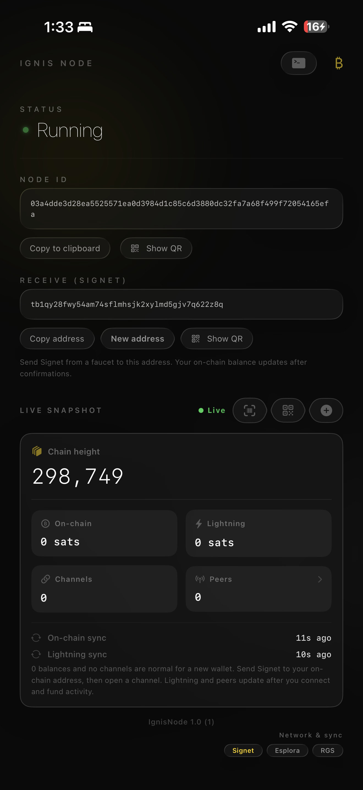</td>
  <td width="33%">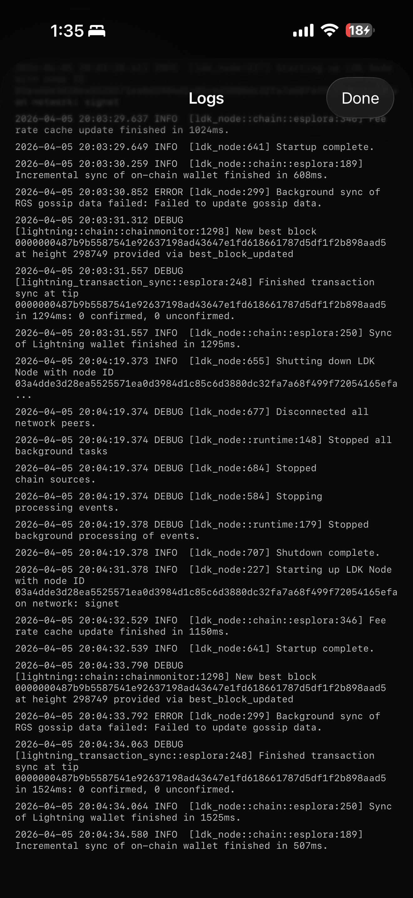</td>
</tr>
<tr>
  <td align="center"><b>Boot loader</b><br/><sub>Lottie overlay while the node starts and first wallet sync completes</sub></td>
  <td align="center"><b>Home</b><br/><sub>Brand, status, node ID, receive, live snapshot</sub></td>
  <td align="center"><b>Log console</b><br/><sub>LDK log tail</sub></td>
</tr>
<tr>
  <td>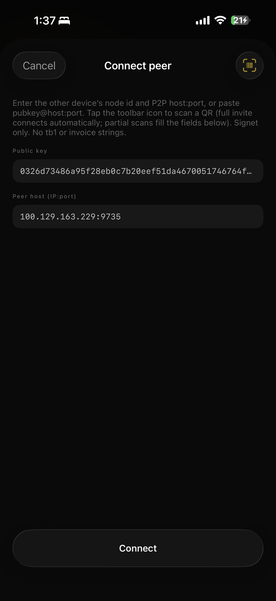</td>
  <td>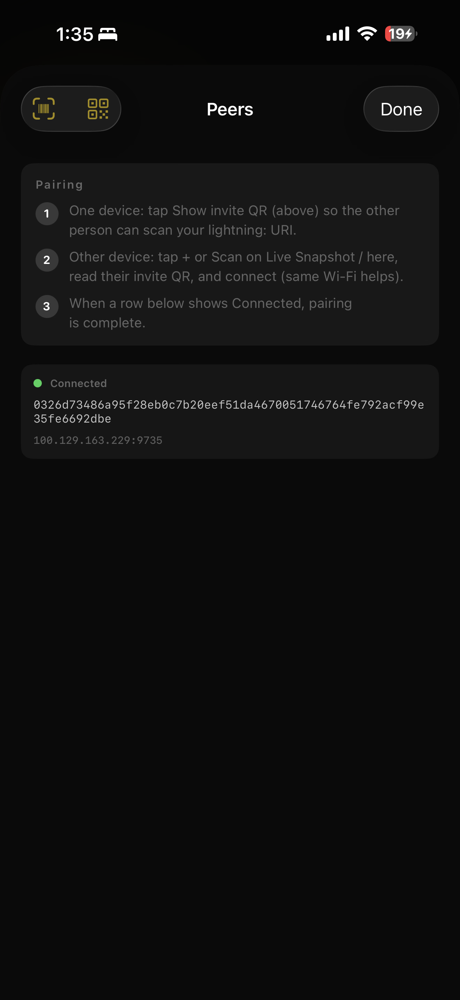</td>
  <td>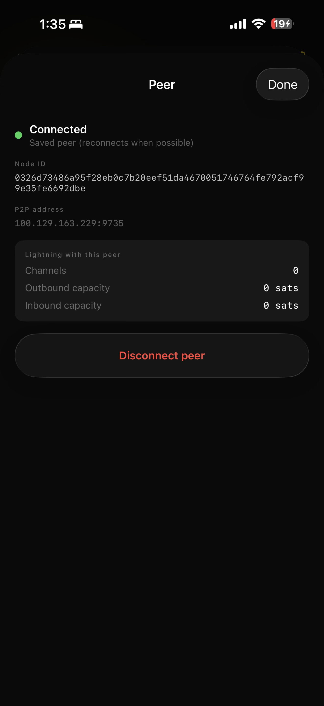</td>
</tr>
<tr>
  <td align="center"><b>Connect peer</b><br/><sub>Manual address / paste</sub></td>
  <td align="center"><b>Peers list</b><br/><sub>Connected and saved peers</sub></td>
  <td align="center"><b>Peer detail</b><br/><sub>Connected peer — node ID, P2P address, channels</sub></td>
</tr>
</table>

---

## 🚀 **Quick Start**

1. **Clone the repository**

   ```bash
   git clone <your-repo-url>
   cd IgnisNode
   ```

2. **Open in Xcode**

   - Double-click **`IgnisNode.xcodeproj`**
   - Wait for Swift Package Manager to resolve **ldk-node** and **lottie-ios**

3. **Pick a simulator**

   - Choose an **iPhone** simulator (e.g. from the run destination menu)

4. **Run**

   - Press **Run** (⌘R) to build and launch **IgnisNode**

5. **Run tests (optional)**

   - Press **⌘U** or use **Product → Test**

---

## 👨‍🔧 **Detailed Setup (Xcode)**

### **Prerequisites**

- **macOS** with **Xcode** installed (version aligned with the project’s tools)
- **iOS Simulator** or a physical device for running the app

### **Swift packages**

1. Open **File → Packages → Resolve Package Versions** if packages fail to fetch.
2. Dependencies are declared in the project; primary packages:
   - `https://github.com/lightningdevkit/ldk-node`
   - `https://github.com/airbnb/lottie-ios`

### **Command-line build**

```bash
xcodebuild -scheme IgnisNode \
  -destination 'platform=iOS Simulator,name=<Simulator>' \
  build
```

List simulators:

```bash
xcrun simctl list devices available
```

---

## 🧪 **Testing**

Test targets cover unit, integration, and UI automation:

| Layer | Coverage |
|--------|----------|
| **Unit** | `IgnisNodeTests` — `NodeStorage` path under Application Support (`signet`) |
| **Integration** | `TwoNodeConnectionTests` — two ephemeral Signet nodes on loopback; Esplora URL list, storage reset, `start()` retries, `stop()` on failed start |
| **UI** | `IgnisNodeUITests` — smoke tests, log sheet, `ignis.*` IDs, `-ui-testing`; `IgnisNodeUITestsLaunchTests` — launch screenshot |

<p align="center">
  
</p>


---

## 🏗️ **Architecture & diagrams**

**Diagrams:** Rendered as **SVG** so they stay readable on GitHub (including dark mode). Editable Mermaid sources: [`docs/diagrams/src/`](docs/diagrams/src/). Regenerate SVGs with `python3 scripts/render_diagrams.py` after editing sources.

**Legend:** **Blue** — application / UI shell · **Green** — `NodeBootstrap` and LDK · **Purple** — Esplora / RGS · **Amber / orange** — decisions and tooling · **Pink** — UI tests · **Sky** — generic steps.

### **System context**

<p align="center">
  
</p>


### **Presentation and domain**

<p align="center">
  
</p>


### **Home screen structure**

<p align="center">
  
</p>


### **Startup and shutdown sequence**

<p align="center">
  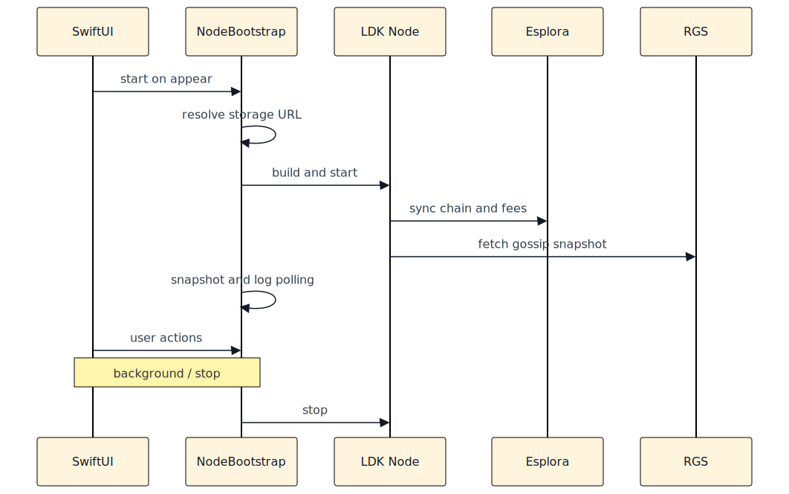
</p>


### **Node lifecycle**

<p align="center">
  
</p>


### **Boot overlay decision**

<p align="center">
  
</p>


### **Storage layout**

<p align="center">
  
</p>


### **Integration test topology**

<p align="center">
  
</p>


<p align="center">
  
</p>


### **Snapshot and log pipeline**

<p align="center">
  
</p>


### **Xcode test bundles**

<p align="center">
  
</p>


### **UI automation path**

<p align="center">
  
</p>


<p align="center">
  
</p>


### **Command-line verification flow**

<p align="center">
  
</p>


### **Peer connection pipeline**

<p align="center">
  
</p>


---

## 📦 **Dependencies**

Swift Package Manager (via Xcode):

- **[lightningdevkit/ldk-node](https://github.com/lightningdevkit/ldk-node)** — LDK Node Swift bindings
- **[airbnb/lottie-ios](https://github.com/airbnb/lottie-ios)** — Boot / loader animation

Open **`IgnisNode.xcodeproj`** and resolve packages before building.

---

## 🔧 **Build & test**

Replace `<Simulator>` with an installed simulator name.

**Build**

```bash
xcodebuild -scheme IgnisNode \
  -destination 'platform=iOS Simulator,name=<Simulator>' \
  build
```

**Run all tests**

```bash
xcodebuild -scheme IgnisNode \
  -destination 'platform=iOS Simulator,name=<Simulator>' \
  test
```

**Notes**

- **Integration tests** use **live Signet Esplora** — network required; endpoints may rate-limit (mitigated with multiple bases and retries).
- **UI tests** pass **`-ui-testing`** so overlays and timing are automation-friendly.

---

## ⚙️ **Configuration defaults**

| Item | Default |
|------|---------|
| Network | Signet |
| Esplora (app) | `https://blockstream.info/signet/api` (no trailing slash) |
| RGS | `https://rgs.mutinynet.com/snapshot` |
| P2P listen (app) | `9735` on `0.0.0.0` |
| Snapshot poll | ~2.5s (`NodeDefaults`) |

---

## 🤝 **Contributing**

We welcome issues and pull requests.

1. **Fork** the repository and **clone** your fork  
2. **Create a branch** — `git checkout -b feature/your-feature`  
3. **Make changes** — match existing Swift style; add or update tests  
4. **Commit** — clear conventional messages  
5. **Open a Pull Request** with a short description and test notes  

**Guidelines**

- Follow the project’s existing structure and naming  
- Add tests for behavior changes where practical  
- Update this README if you change public behavior or layout  

---

## 📜 **License**

This project is licensed under the **MIT License** — see the [`LICENSE`](LICENSE) file when present in the repository root.

---

### **Contact**

For bug reports and feature requests, use your repository’s **Issues** tab.

